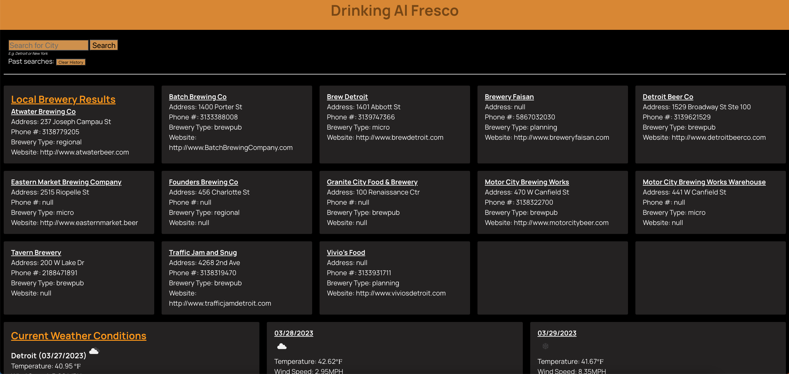
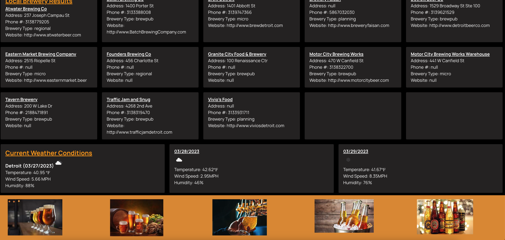

# Drinking Al Fresco

## Description
Drinking Al Fresco is a website that travelers can use to determine the location of a brewery in the city of their choosing. At the same time, a 2-day weather forecast will also be displayed so the user can determine their travel plans. The location can be saved in the search history for future reference and can also be cleared. When the page is refreshed, the results for the last performed search will appear. If the search history is cleared, a default city will appear with search results and weather conditions. 

## Installation
N/A

## Usage
Simply type in the city of your choice into the search bar and select "search". Once the search has been made, a list of breweries in that specific city will appear, along with the current and 2-day weather forecast to allow travelers to plan their outing accordingly. The city searches will save and remain on the webpage until cleared. 

## Credits

Special thank you to Geraldo Gonzalez for assistance and mentoring with use of the Open Brewery DB API.

https://fonts.google.com/

https://openweathermap.org/

https://www.openbrewerydb.org/

https://day.js.org/en/

https://jquery.com/

https://bulma.io/

## Features
Drinking Al Fresco features a search bar which will output a list of breweries in the city of the users choosing, as well as the current and 2-day future weather forecast. This website features Bulma CSS.

## Links
Github: https://github.com/cthibodeau09/Drinking_Al_Fresco

Deployment: https://cthibodeau09.github.io/Drinking_Al_Fresco/